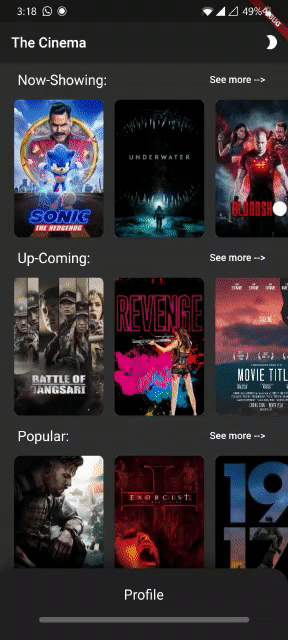
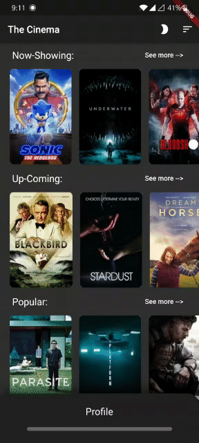
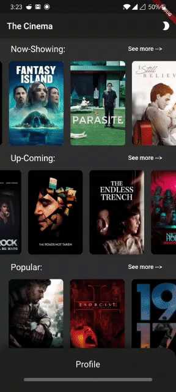
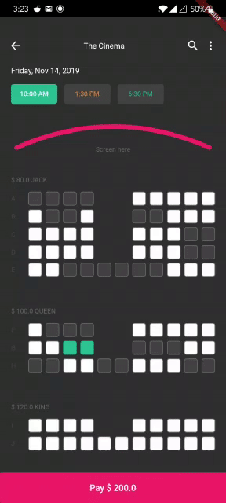

# the_cinema

A movie ticket booking system

# Features
* **Login and Register**  
     
* **Browse Movies**  
     
* **Filter Movies**  
     
* **Upcoming Movies**  
     
* **Details Page**  
     
* **Seat Selection**  
     
* **Payment Page**  
     
* **Order Summary**  
     

# Tech Used
* **[Flutter](https://flutter.dev/docs)** 
* **[API](https://www.themoviedb.org/)**
* **[State Management](https://pub.dev/packages/bloc)**
* **[Payment Portal](https://razorpay.com/)**

## Getting Started

A few resources to get you started if this is your first Flutter project:

- [Lab: Write your first Flutter app](https://flutter.dev/docs/get-started/codelab)
- [Cookbook: Useful Flutter samples](https://flutter.dev/docs/cookbook)

For help getting started with Flutter, view our
[online documentation](https://flutter.dev/docs), which offers tutorials,
samples, guidance on mobile development, and a full API reference.
